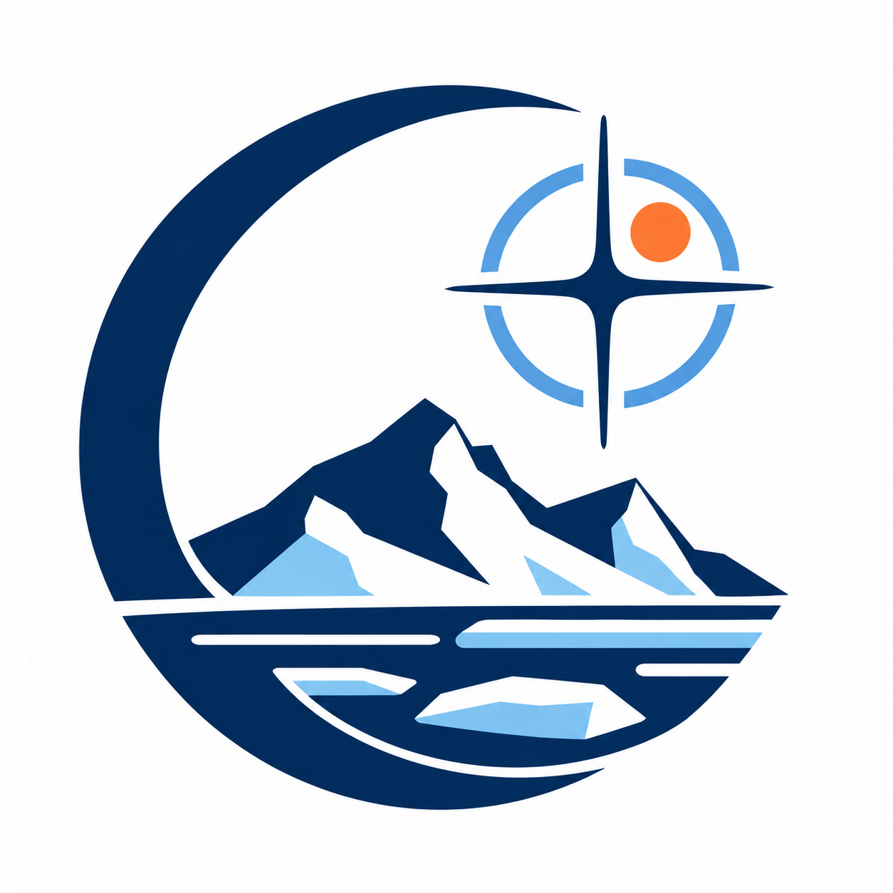
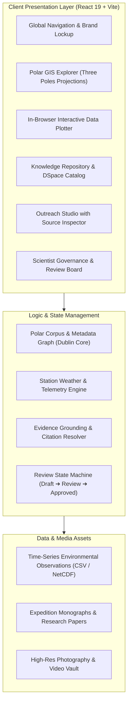

<!-- prettier-ignore -->
<div align="center">



# Polar Vidya

**Integrated Polar Science Outreach, Knowledge Repository and Media Dissemination Platform**

[](https://react.dev)
[](https://vitejs.dev)
[](https://nodejs.org)
[](https://github.com)
[](#)

<p align="center">
  Connecting four decades of Indian polar expeditions across Antarctica, the Arctic, and the Himalayas into an interactive, public-facing discovery platform with evidence-grounded AI and scientist-reviewed dissemination.
</p>

[Overview](#overview) • [Key Features](#key-features) • [Polar Stations & Scope](#polar-stations--scope) • [Architecture](#architecture) • [Getting Started](#getting-started) • [Repository Structure](#repository-structure)

</div>

---

## Overview

India's Polar Research program spans over four decades of scientific expeditions across Earth's Three Poles: **Antarctica** (South Pole), the **Arctic** (North Pole), and the **Himalayas** (the Third Pole). While valuable expedition reports, atmospheric datasets, satellite telemetry, and field photography exist, these assets have historically remained locked in siloed archives and dense academic monographs.

**Polar Vidya** is an integrated knowledge repository, interactive data visualization engine, and science dissemination platform. It transforms complex polar science into accessible, verifiable public outreach through interactive exploration, in-browser data plotting, and evidence-grounded AI with mandatory scientist review.

> [!NOTE]
> **Evidence-Grounded Principle**: Polar Vidya enforces strict citation locking. Every AI-generated student explainer, press release, or social thread is anchored to verified paragraph and table offsets in official expedition monographs and reports, eliminating freeform hallucinations.

---

## Key Features

### 1. Interactive Polar Command Center & Polar GIS
- **Three-Pole Geographic Coverage**: Specialized polar projections for Antarctica (EPSG:3031), the Arctic (EPSG:3413), and the high-altitude Himalayan glaciated basins.
- **Live Station Telemetry**: Real-time monitoring of active Automatic Weather Stations (AWS) tracking temperature, wind velocity, barometric pressure, and solar radiation.
- **Station Dossiers**: Deep profiles of research stations including scientific capabilities, logistical access, year of commissioning, and current wintering crews.

### 2. "Ask-the-Data" In-Browser Scientific Plotter
- **Zero-Dependency Visualization**: Eliminates the need for heavy desktop software (e.g. QGIS, MATLAB, Panoply) by rendering dynamic, interactive SVG time-series charts directly in the browser.
- **Multidisciplinary Datasets**: Pre-indexed records across Cryosphere, Atmosphere, Oceanography, Paleoclimate, and Polar Biology.
- **Interactive Inspection**: Dynamic cursor scrubbers, statistical anomaly detection, baseline deviation analysis, and direct CSV/NetCDF export.

### 3. Unified Knowledge Repository & Expedition Reports
- **Dublin Core & DataCite Metadata Standards**: Cataloged metadata including DOI, expedition numbers, chief scientists, research domains, and citation indices.
- **Historical Expedition Archive**: Chronological coverage spanning from the historic 1st Indian Antarctic Expedition (1981) to recent Arctic and Southern Ocean cruises.
- **Connected Knowledge Graph**: Seamless relational links connecting *Expedition &rarr; Research Station &rarr; Principal Investigator &rarr; Dataset &rarr; Publication*.

### 4. Grounded Outreach Studio & Plain-Language Translation
- **Multi-Tier Audience Modes**: Instant translation of dense scientific papers into four tuned reading levels:
  - Middle School (8th Grade fundamentals & analogies)
  - High School & Undergraduate (Curriculum-aligned concepts)
  - Press Release (PIB & science journalism standard)
  - Social Media Brief (Thread format with verified takeaways)
- **Side-by-Side Source Inspector**: Inspect exact source sentences used to produce each summary paragraph.

### 5. Editorial Review & Scientist Governance Queue
- **Human-in-the-Loop Safeguards**: Science communication requires scientific accountability. AI drafts enter a review state machine:
  $$\text{AI Draft Generated} \longrightarrow \text{In Scientist Review} \longrightarrow \text{Approved / Certified} \longrightarrow \text{Dispatched}$$
- **Role-Based Approvals**: NCPOR scientists can review cited source spans, annotate revisions, and approve drafts before publication to external outreach channels.

### 6. Multimedia Vault & Field Operations
- **High-Definition Polar Media Bank**: Curated collection of 4K drone footage, ROV seabed photography, ice-core drilling operations, and wildlife surveys.
- **Expedition Replay**: Visual tracking of historic voyage routes, including ORV Sagar Kanya and polar resupply vessel transits.
- **Ask a Scientist**: Direct citizen-science inquiry channel routing public questions to domain specialists in glaciology, oceanography, and atmospheric physics.

---

## Polar Stations & Scope

Polar Vidya indexes operational data, historical logs, and environmental telemetry across India's active and historic polar facilities:

| Region | Station / Observatory | Location | Coordinates | Established | Primary Research Domains |
| :--- | :--- | :--- | :--- | :--- | :--- |
| **Antarctica** | **Bharati** | Larsemann Hills | $69^\circ 24'\text{S},\ 76^\circ 11'\text{E}$ | 2012 | Oceanography, continental breakup, atmospheric science |
| **Antarctica** | **Maitri** | Schirmacher Oasis | $70^\circ 46'\text{S},\ 11^\circ 44'\text{E}$ | 1989 | Meteorology, glaciology, geomagnetism, human physiology |
| **Antarctica** | **Dakshin Gangotri** | Ice Shelf *(Historic)* | $70^\circ 05'\text{S},\ 12^\circ 00'\text{E}$ | 1983 | First Indian permanent Antarctic base *(now sub-surface site)* |
| **Arctic** | **Himadri** | Ny-Ålesund, Svalbard | $78^\circ 55'\text{N},\ 11^\circ 56'\text{E}$ | 2008 | Aerosol dynamics, fjord biology, glacial retreat monitoring |
| **Arctic** | **IndARC** | Kongsfjorden | $78^\circ 57'\text{N},\ 12^\circ 01'\text{E}$ | 2014 | Multi-sensor underwater mooring observatory for Arctic climate |
| **Arctic** | **Gruvebadet Lab** | Ny-Ålesund, Svalbard | $78^\circ 55'\text{N},\ 11^\circ 53'\text{E}$ | 2015 | Atmospheric chemistry, black carbon, optical depth analysis |
| **Third Pole** | **Himansh** | Chandra Basin, Spiti | $32^\circ 26'\text{N},\ 77^\circ 37'\text{E}$ | 2016 | High-altitude Himalayan glaciology, mass balance (4,080 m) |

---

## Architecture

The system is organized into modular layers connecting data exploration, visualization, and governed dissemination:



> [!TIP]
> **Performance**: The frontend runs as a lightweight, zero-latency single-page application built on React 19 with Vite, maintaining near-instant navigation across dense scientific catalogs.

---

## Getting Started

### Prerequisites

- [Node.js](https://nodejs.org/) (version **18.0** or higher recommended)
- `npm` (bundled with Node.js) or `pnpm` / `yarn`

### Installation

1. **Clone the repository**:
   ```bash
   git clone https://github.com/Divyansh-2903/Polar-Science-Portal.git
   cd Polar-Science-Portal
   ```

2. **Install dependencies**:
   ```bash
   npm install
   ```

3. **Start the local development server**:
   ```bash
   npm run dev
   ```

4. **Open in browser**:
   Navigate to the local URL displayed in your terminal (typically `http://localhost:5173`).

### Production Build

To create an optimized production bundle:

```bash
npm run build
```

To preview the production build locally:

```bash
npm run preview
```

### Code Quality & Linting

Run Oxlint to check codebase consistency:

```bash
npm run lint
```

---

## Repository Structure

```text
Polar-Vidya/
├── public/
│   ├── polaris-logo.png          # Portal identity badge
│   ├── hero-polar-station.jpg    # Polar station expedition photography
│   └── stations/                 # Station gallery assets (Bharati, Maitri, Himadri, Himansh)
├── src/
│   ├── components/
│   │   ├── Header.jsx            # Responsive navigation & module switcher
│   │   ├── PolarCommandCenter.jsx# Operational hero, telemetry ticker & bento grid
│   │   ├── PolarExplorerMap.jsx  # Interactive GIS mapping across Arctic, Antarctic & Himalayas
│   │   ├── DatasetsHub.jsx       # Datasets catalog & interactive SVG time-series visualizer
│   │   ├── KnowledgeRepository.jsx# Dublin Core report repository & author search
│   │   ├── OutreachStudio.jsx    # Evidence-grounded multi-audience content generator
│   │   ├── EditorialQueue.jsx    # Scientist review queue with governance states
│   │   ├── MediaVault.jsx        # High-resolution video and photo bank
│   │   ├── ExpeditionReplay.jsx  # Voyage route replay & expedition milestones
│   │   ├── AskPolarAI.jsx        # Grounded semantic question-answering
│   │   ├── AskScientist.jsx      # Researcher inquiry & community Q&A portal
│   │   └── AnomalyAlerts.jsx     # Cryosphere & blizzard alert monitoring
│   ├── data/
│   │   ├── polarCorpus.js        # Structured scientific corpus, papers, citations & reviews
│   │   └── portalData.js         # Weather feeds, station profiles & telemetry records
│   ├── App.jsx                   # Root application state & navigation router
│   ├── index.css                 # Design tokens, typography & modern layout utilities
│   └── main.jsx                  # React 19 application entry point
├── package.json
└── vite.config.js
```
