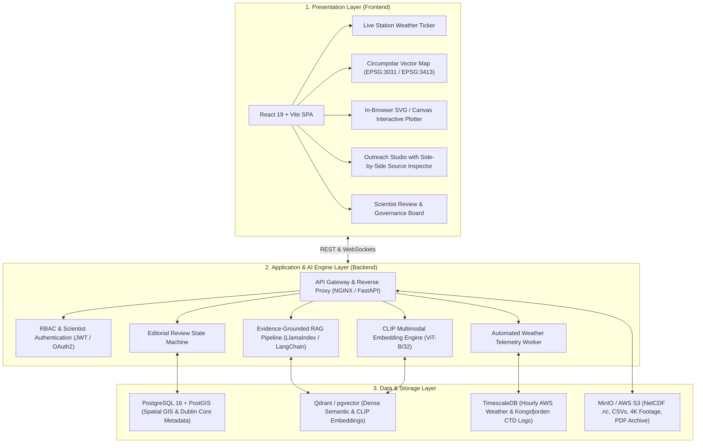

# Polar Science Portal (POLARIS) — Technical Architecture Specification

**Problem Statement Code:** SIH26063  
**Sponsoring Ministry:** Ministry of Earth Sciences (MoES), Government of India  
**Nodal Institution:** National Centre for Polar and Ocean Research (NCPOR), Goa  
**Primary Scope:** The Three Poles — Antarctica (South Pole), Arctic (North Pole), Himalayas (Third Pole)  
**Document Version:** 1.0 (Technical Presentation & Evaluation Ready)  

---

## 1. Executive Technical Summary

The **Polar Science Portal (POLARIS)** is built on an enterprise-grade, **3-Tier Microservices Architecture** designed to bridge 40+ years of Indian polar expedition data with public understandability, student education, and scientific governance.

### Core Architectural Mandates:
1. **Zero Hallucination AI (Evidence Grounding):** Every AI-generated summary, lesson, or social post is locked to exact sentence/paragraph offsets in official NCPOR expedition reports.
2. **In-Browser Scientific Visualizer:** Eliminates dependency on heavy desktop GIS or NetCDF viewers (QGIS, MATLAB, Panoply) by rendering dynamic, interactive SVG/Canvas charts directly in modern web browsers.
3. **Multimodal Media Discovery:** Leverages contrastive vision-language embeddings (OpenAI CLIP) to search 4K drone reels, field photography, and sensor feeds via natural human descriptions rather than technical keywords.
4. **Mandatory Scientist Governance:** Enforces a human-in-the-loop state machine where qualified researchers review and digitally approve content before public dissemination.

---

## 2. End-to-End System Architecture



---

## 3. Technology Stack Breakdown

### 3.1. Frontend Technologies (Presentation Tier)

| Software / Library | Version / Spec | Architecture Role | Why This Choice? |
| :--- | :--- | :--- | :--- |
| **React** | `19.2.8` | Core UI Framework | Concurrent rendering, declarative component architecture, zero-dependency state synchronization. |
| **Vite** | `8.3.0` | Build Tool & Dev Server | Native ESModules, sub-second Hot Module Replacement (HMR), optimized Rollup production builds. |
| **Vanilla CSS3** | Custom Token System | Design System & Styling | Hardware-accelerated CSS custom properties (`--blue-primary`, `--accent-cyan`), glassmorphism, responsive `clamp()` layouts without Tailwind bloat. |
| **Dynamic Vector Engine** | SVG & HTML5 Canvas | Chart & Data Visualization | Client-side parametric curve rendering for time-series (temperature, wind gusts, pressure) and depth profiles. |
| **Circumpolar Map Engine** | Custom Projection Canvas | Spatial GIS Explorer | Vector projection supporting Antarctic (**EPSG:3031**) and Arctic (**EPSG:3413**) views with live station markers and ship tracks. |
| **Lucide React** | `1.48.0` | UI & Domain Icons | Lightweight, tree-shakable SVG iconography for scientific sensors, bases, and metrics. |
| **Canvas Confetti** | `1.9.4` | Gamification & Polish | Visual micro-rewards upon editorial approvals and quiz completions. |

---

### 3.2. Backend & AI Processing Technologies (Logic Tier)

| Software / Tool | Version / Spec | Architecture Role | Technical Capability |
| :--- | :--- | :--- | :--- |
| **FastAPI** | Python 3.11+ | Asynchronous REST Gateway | High-throughput ASGI server with native Pydantic typing, auto OpenAPI docs, and WebSocket streaming. |
| **LangChain / LlamaIndex** | Latest Stable | RAG Pipeline Orchestrator | Chunks expedition reports, manages dense vector lookups, and constructs evidence-grounded prompt templates. |
| **Embedding Model** | `BGE-M3` / `text-embedding-3-small` | Dense Vector Representation | Multi-lingual, dense retrieval generating 1024/1536-dimensional embeddings for academic texts. |
| **OpenAI CLIP** | `ViT-B/32` | Multimodal Search Engine | Joint vision-language space indexing 4K drone reels and photographs for natural language visual search. |
| **Source-Span Lock Engine** | Custom Python Engine | Anti-Hallucination Gate | Computes character offsets between generated claims and source text; produces citation anchors for instant UI highlighting. |
| **Uvicorn / Gunicorn** | Production Server | Web Server & Process Manager | Worker-based process pooling with automatic worker restart and load balancing. |

---

### 3.3. Database & Storage Architecture (Data Tier)

| Database / Store | Technology | Data Models & Schemas Stored | Key Features |
| :--- | :--- | :--- | :--- |
| **Relational Database** | **PostgreSQL 16 + PostGIS** | Stations, voyages, scientists, Dublin Core metadata, user roles. | Spatial indexing (`ST_DWithin`, `ST_Point`) for base locations and ship voyage waypoints. |
| **Vector Database** | **Qdrant / pgvector** | Document chunks, research abstracts, CLIP image feature vectors. | HNSW indexing for sub-10ms similarity search across multi-decade polar archives. |
| **Time-Series Database** | **TimescaleDB** | Continuous Automated Weather Station (AWS) records, IndARC CTD depth logs. | Hypertable partitioning with automated retention policies and fast analytical rollups. |
| **Object Storage** | **MinIO / AWS S3** | Raw NetCDF (`.nc`) files, CSV data, 4K video clips, master PDF reports. | High-bandwidth binary file storage with S3-compatible pre-signed URLs and CDN caching. |

---

## 4. Key Subsystems & Technical Workflows

### 4.1. "Ask-the-Data" Natural Language Visualizer
1. **User Query:** User inputs natural question: *"Show me Bharati Station winter temperature and wind speeds"*.
2. **Intent Parsing:** Backend extracts entity (`station: Bharati`), parameter (`temperature`, `wind`), and temporal bounds (`winter / July–August`).
3. **Time-Series Query:** TimescaleDB executes an optimized bucket rollup (`time_bucket('1 hour', time)`).
4. **JSON Streaming:** API streams calibrated statistical values (mean, peak gust, minimum) to the client.
5. **Client-Side Rendering:** React renders a interactive SVG graph with area gradients, hover tooltip cards, and 1-click CSV download.

---

### 4.2. Evidence-Grounded Outreach Studio (Anti-Hallucination Pipeline)
1. **Report Ingestion:** A 50-page PDF expedition report is ingested, chunked by structural headings, and stored with paragraph IDs (`P01`, `P02`, etc.).
2. **Audience-Adapted Generation:** The LLM generates text targeted to school students, news journalists, or social channels.
3. **Citation Span Constraint:** For every statement generated, the LLM must provide the exact `sourceId` and text span.
4. **Side-by-Side Synchronized UI:** Clicking any claim on the left automatically scrolls the right pane to the exact paragraph with high-contrast amber highlighting.

---

### 4.3. Scientist Review & Editorial Governance State Machine
To guarantee scientific integrity before content reaches the public:

```text
[ 1. AI Draft Generated ]
          │
          ▼
[ 2. In Review (Assigned to NCPOR Scientist) ]
          │
    ┌─────┴────────────────┐
    ▼                      ▼
[ Request Edits ]      [ 3. Approved & Signed (Reviewer Sign-Off) ]
                           │
                           ▼
                       [ 4. Scheduled Dissemination ]
                           ├── PIB Official Press Release
                           ├── High School Curricular Module
                           └── National Science Day Campaign
```

---

## 5. Security, Standards & Compliance

* **Metadata Interoperability:** Implements **ISO 19115** (Geographic Information - Metadata) and **DataCite** schema for persistent DOI registration.
* **Open Data Licensing:** Media assets tagged with Creative Commons (**CC BY 4.0** / **CC0 Public Domain**) for unrestricted educational and news broadcast use.
* **Authentication & RBAC:** JWT bearer tokens with role separation: `Citizen`, `Student`, `Science Communicator`, and `NCPOR Scientist Reviewer`.
* **Containerization:** Modular `Dockerfile` and `docker-compose.yml` for reproducible zero-downtime deployment.

---

## 6. Slide-by-Slide Presentation Guide for Judges

| Slide # | Slide Title | Key Technical Points to Speak |
| :---: | :--- | :--- |
| **1** | **System Architecture** | "Built on a modern 3-tier architecture: React 19 frontend, FastAPI logic layer, and PostgreSQL + Qdrant + TimescaleDB data tier." |
| **2** | **Solving the Data Silo Gap** | "Old portals scatter NetCDF files, PDFs, and weather links. Our unified entity knowledge graph connects Paper ➔ Scientist ➔ Base ➔ Dataset ➔ 4K Media." |
| **3** | **Zero-Hallucination AI** | "We do not let LLMs guess. Our source-span lock engine references exact paragraph offsets, allowing 1-click evidence audit." |
| **4** | **In-Browser Chart Engine** | "No specialized software needed. Citizens and students explore hourly polar temperatures and ocean CTD profiles right in their browser." |
| **5** | **Multimodal CLIP Discovery** | "Search photos and drone videos by description (e.g., 'convoy crossing ice shelf') using OpenAI CLIP multi-vector index." |
| **6** | **Scientist Governance Gate** | "Human-in-the-loop state machine ensures every public post is fact-checked and signed off by an authorized Indian polar scientist." |
